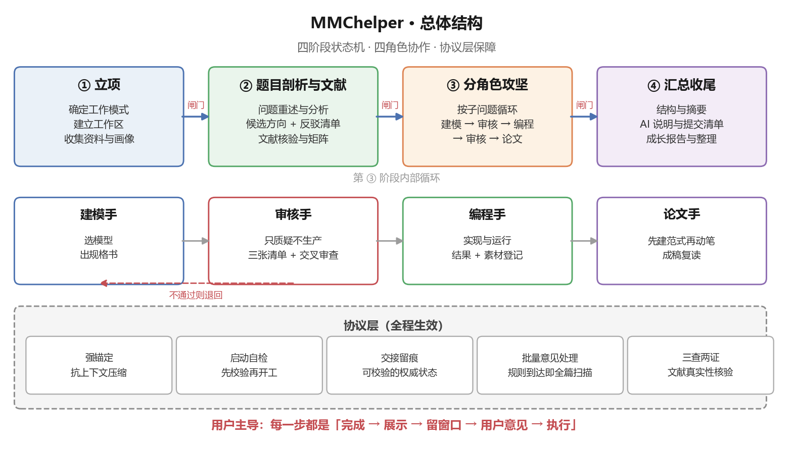

[English](README.md) · [简体中文](README.zh-CN.md)

# mmc-helper · A Full-Workflow Assistant Skill for Mathematical Modeling Contests

> A **full-workflow collaboration assistant** for mathematical modeling contests
> (CUMCM / MCM·ICM / graduate contests / school contests).
> Core principle: **the user always stays in control.**



> The skill's own content is written in Chinese; the diagram above is likewise in Chinese
> for consistency with the skill internals.

---

## Table of Contents

- [Why I built this](#why-i-built-this)
- [What it solves](#what-it-solves)
- [Quick start](#quick-start)
- [Installation](#installation)
- [Repository map](#repository-map)
- [Design highlights](#design-highlights)
- [A personal note](#a-personal-note)
- [License](#license)

---

## Why I built this

I have been involved in mathematical modeling contests since my first year. What draws me in is
that they ask you to extract a mathematical model from a real-world problem, then use algorithms
and the fidelity of that model to characterize the solution — searching for the best approach.

Every time I read a contest problem, I am struck by how **grounded** it is. Unlike the problems I
solved in middle and high school, these come closer and closer to real-world engineering. Thinking
about them is genuinely exciting — as if I were standing next to an engineer, reasoning about
whether a solution could actually work.

When I first started competing, I was not a computer-science student, and the generative AI of the
time could only (at least given how little I then knew about prompting and about the state of the
art) check my code and tell me how to adjust a Word layout.

As the field moved forward and more of its vocabulary entered common knowledge, a thought took hold:
what if I could learn to write a *skill* — one that turns an agent into a modeling-contest teammate?
One that thinks through the problem with us, hunts for a modeling direction, helps build the code and
catches problems early, and helps check and refine the paper's formatting and the details worth
polishing.

So I went ahead and built it. That is how this skill came to be.

---

## What it solves

In my view, the time pressure of a modeling contest comes from three places:
**repeated changes of modeling direction, a gap between the code and the model, and rework in paper writing.**
mmc-helper addresses them with three mechanisms.

### A multi-stage state machine

The flow of a modeling contest is in fact fixed:

> pick the problem → search the literature for modeling and algorithmic solutions → start solving →
> build the model → implement the algorithm and process the results → write and finalize the paper

So I fixed that flow as a strict pipeline, which both keeps things on track and lets each stage focus
on its own task. The pipeline is:

> project setup → agree on the collaboration mode → user profile and background materials →
> problem analysis and literature assembly → role-by-role attack → wrap-up

Every stage has a **gate**: the next stage only begins once the user agrees. The whole process is
transparent, and each stage's output is shown to the user as it is produced.

### Role-based collaboration

A modeling contest is usually a three-person effort, and this skill mirrors that division — plus one
extra teammate: **modeler / coder / writer / auditor**.

These roles can be assigned to subagents, or the project can simply advance in the order
*modeling → coding → writing*. The auditor sits outside the main flow and only reviews the overall
approach, correcting course and catching mistakes. Hand-offs between the main-flow roles follow the
gates strictly, and switching roles always waits for the user's decision.

### A strong protocol layer

Testing surfaced a wide range of problems. Drawing on that experience and on my overall vision for the
skill, I established the following mandatory protocols: **anchoring, startup self-verification, audit,
hand-off traceability, and batch-feedback handling** — turning "following the process" from something
that depends on memory into something that depends on mechanism.

---

## Quick start

```
I'm entering a mathematical modeling contest. Here is the problem — help me get started.
```

→ Enters Phase 0: confirm the working mode → create the workspace → collect materials → run the
startup self-verification.

```
Which model fits this sub-problem?
```

→ The modeler proposes candidates with trade-offs and a rebuttal list → the user decides → a model
specification is written → the auditor verifies it.

```
Help me do the final check.
```

→ Structure review / abstract / literature cross-check / AI-usage statement / submission checklist /
growth report / directory cleanup.

---

## Installation

**This repository is the skill.** Two steps:

1. Clone or download it so that you end up with a directory named `mmc-helper/`
   (the name already matches the `name` field in `SKILL.md`), then place that directory
   in your skills directory;
2. Reload the skill list and confirm it is registered.

The installed layout should look like:

```
<skills directory>/
└── mmc-helper/
    ├── SKILL.md          ← the only file the loader reads
    ├── agents/ protocols/ references/ templates/
    ├── examples/ paper-library/
    └── INDEX.md  CHANGELOG.md  README.md
```

> Every document other than `SKILL.md` is reference material for humans and agents.
> **None of them affect skill loading.**

---

## Repository map

| To learn about | Read |
|---|---|
| Entry point and the anchoring clause | `SKILL.md` |
| A map of the whole repository | `INDEX.md` |
| Version history | `CHANGELOG.md` |
| What each role does | `agents/` |
| How each protocol works | `protocols/` |
| Knowledge and rationale | `references/` |
| Ready-to-use templates | `templates/` |
| Distilled notes on award-winning papers | `paper-library/` |

---

## Design highlights

- **Anchoring**: once activated, the skill stays in effect until the user explicitly ends it — it
  survives context compaction (`protocols/anchoring.md`);
- **Verifiable state**: `state.json` records artifacts, active parameters, superseded items and open
  questions; a new session starts by running the startup self-verification
  (`protocols/startup_verify.md`);
- **Independent audit**: the auditor only challenges, never produces; it may read the problem but is
  kept away from the project's history, and it performs **cross-question review** ("did this question
  repeat a defect seen in earlier ones?");
- **A writing-pattern library**: it distills *how to say things* into transferable patterns
  (`references/style_patterns.md`) instead of merely listing forbidden words;
- **A known-pitfalls list**: 18 common defects, each with "how to detect it"
  (`references/known_pitfalls.md`).

---

## A personal note

Mathematical modeling contests are gradually drifting away from their original direction, and that is
not what most of us would hope to see: AI is **becoming** a *necessity* for producing excellent work.
In recent contests, forums are full of discussions about how to use AI, agents and skills to produce
an almost perfect line of reasoning or an almost perfect paper.

**I am not opposed to using AI.** What concerns me is this: if AI keeps taking over more of the work
while the user's own knowledge fails to keep pace, and if problems keep getting harder specifically to
resist AI, how is an ordinary participant supposed to judge whether every output is correct and
reasonable? And how can each AI-assisted contest remain both a competition and a learning experience?

That concern is exactly why this skill places such heavy emphasis on traceability, and why it produces
a growth report at the end. AI keeps moving forward; those of us who use it must work to keep up — so
that every generation an AI produces can be judged, with our own knowledge and what we have learned,
for whether it is right.

---

## License

See [LICENSE](LICENSE).
